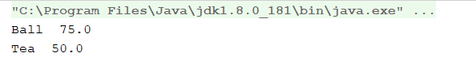

== Adapter Pattern

Bazı durumlarda clienta sunduğunuz kodda kalıbı bozmadan ufak değişiklikler yaparak yazılımın geliştirilmesi gerekebilir.
İki uyumsuz interface’i beraber kullanmamızı sağlar.Daha önce yazılmış olan kodları düzenlemek zorunda kalmayız.Adapter’in amacı Client’ın beklediği servisleri, farklı bir arayüz ile o sınıfa ait servisleri kullanabileceği yapıyı oluşturmaktır.

Ben projemde bir mağaza ve marketi ürünlerinin satılması için adapter geliştirdim örneğin spor malzemeleri satılan bir e-mağaza için market ürünleri olan çay,kahve gibi gıdaların satılmasını sağladım

== Adapter Pattern Kodu

[source,Java]
----
public class Main {
    public static void main(String[] args){

        ShopInventory inventory = new ShopInventory();

        inventory.addProduct(new SportProduct("Ball", 75));

        MarketItem marketItem = new MarketItem("Tea", 50);
        inventory.addProduct(new MarketItemAdapter(marketItem));

        System.out.println(inventory.getProducts().get(0).getName()+"  "+inventory.getProducts().get(0).getPrice());
        System.out.println(inventory.getProducts().get(1).getName()+"  "+inventory.getProducts().get(1).getPrice());

    }
}

public class ShopInventory {<1>

    private List<Product> products;

    public List<Product> getProducts() {
        return products;
    }

    public void setProducts(List<Product> products) {
        this.products = products;
    }

    public ShopInventory() {
        this.products = new ArrayList<Product>();
    }

    public void addProduct(Product product) {
        this.products.add(product);
    }

    public void removeProduct(Product product) {
        this.products.remove(product);
    }
}

public class SportProduct implements Product{

    String itemName;
    double costPerUnit;

    public SportProduct(String itemName, double costPerUnit) {
        this.itemName = itemName;
        this.costPerUnit = costPerUnit;
    }

    public String getName() {
        return itemName;
    }

    public double getPrice() {
        return costPerUnit;
    }
}

public class MarketItem {<2>

    String itemName;
    int costPerUnit;

    public MarketItem(String itemName, int costPerUnit) {
        this.itemName = itemName;
        this.costPerUnit = costPerUnit;
    }

    public String getItemName() {
        return itemName;
    }

    public void setItemName(String itemName) {
        this.itemName = itemName;
    }

    public int getCostPerUnit() {
        return costPerUnit;
    }

    public void setCostPerUnit(int costPerUnit) {
        this.costPerUnit = costPerUnit;
    }
}

public class MarketItemAdapter implements Product {<3>

    private MarketItem marketItem;

    public MarketItemAdapter(MarketItem marketItem) {
        this.marketItem = marketItem;
    }

    public MarketItem getMarketItem() {
        return marketItem;
    }

    public void setMarketItem(MarketItem marketItem) {
        this.marketItem = marketItem;
    }

    public String getName() {
        return marketItem.getItemName();
    }

    public double getPrice() {
        return marketItem.getCostPerUnit();
    }

}

public interface Product {<4>
    String getName();
    double getPrice();
}
----

<1> Shop envanterlerini ve ürünlerini tutan listelerin bulunduğu sınıfım
<2> Marketi itemleri için oluşturduğum sınıfım
<3> Market itemlerini shop itemlerine çeviren adapter sınıfım
<4> Adapter patternine uygun olarak uygun olarak tasarladığım interface yapım

=== Kod Çıktısı

Kod çıktımızda normal olarak spor malzemesi ekleyebildiğimizi ve adapter yardımıyla market ürünü olan çay'ı ekleyebileceğimizi gördük.

== UML Diyagramı
....
@startuml
class Main{
  +void main()
}
interface Product<<interface>> {
  +String getName()
  +double getPrice()
}

class MarketItemAdapter{
  -MarketItem marketItem
}
class MarketItem {
    +String itemName;
    +int costPerUnit;
}
class SportProduct{
    +String itemName;
    +double costPerUnit;
}
class ShopInventory {
 -List<Product> products;
 +void addProduct()
 +void removeProduct()
}
Product<|..MarketItemAdapter
Product<|..SportProduct
Main ---> MarketItem
MarketItemAdapter ---> MarketItem
Main --->SportProduct
Main --->ShopInventory
@enduml
....
