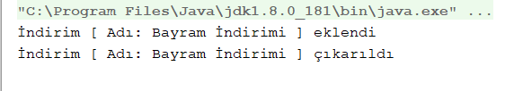
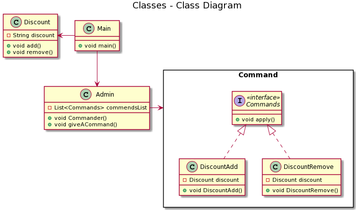

= Command Pattern

Bu tasarım deseninde, nesneler bir işlevi ve bu işlev için gerekli değişkenleri içerirler. Dışarıdan bu nesneler tetiklenerek bazı işlemler gerçekleştirilir. Bu tasarım deseniyle, işlemi tetikleyecek nesneler ile işlemi yapan nesneler birbirlerinden ayrılmış olur. Projemde bir e-ticaret sitesi yönetimi için indirim ekleme ve silme komutlarını command pattern ile gerçekleştirdim.Komutlar bir aracı sınıf üzerinden geliştirildi.

== Command Pattern Kodu

[source,Java]
----
public interface Commands {
    void apply();<1>
}
----
[source,Java]
----
public class DiscountAdd implements Commands{

    private final Discount discount;<2>

    public DiscountAdd(Discount discount){
        this.discount = discount;
    }
    public void apply() {
            discount.add();
    }
}
public class DiscountRemove implements Commands{

    private final Discount discount;

    public DiscountRemove(Discount discount){
        this.discount = discount;
    }
    public void apply() {
        discount.remove();
    }

}
----
[source,Java]
----
public class Admin {

    private List<Commands> commendsList = new ArrayList<Commands>();<3>
    public void Commander(Commands commands){
        commendsList.add(commands);
    }

    public void giveACommand(){

        for (Commands commands : commendsList) {
            commands.apply();
        }
        commendsList.clear();
    }
}
public class Discount {

    private final String discount = "Bayram İndirimi";

    public void add(){
        System.out.println("İndirim [ Adı: "+discount+" ] eklendi");
    }
    public void remove(){
        System.out.println("İndirim [ Adı: "+discount+" ] çıkarıldı");
    }
}
public class Main {
    public static void main(String[] args) {
        Discount discount = new Discount();

        DiscountAdd discountAdd = new DiscountAdd(discount);
        DiscountRemove discountRemove = new DiscountRemove(discount);

        Admin admin = new Admin();
        admin.Commander(discountAdd);
        admin.Commander(discountRemove);

        admin.giveACommand();
    }
}

----

<1> Burada uygula metodumuzu bulunduran interfacemizi oluşturuyoruz.
<2> Burada oluşturduğumuz interfacemizi implement edip indirim ekleme komutumuzu içeren sınıfı oluşturuyoruz.
<3> Bu kısım bizim aracı sınıfımız bir admin bu kontrolü sağlayarak gerekli işlemleri yapıyor.

=== Kod Çıktısı

Burada kod çıktımızın başarılı bir şekilde indirim ekleme ve silme komutlarını gerçeklediğini görüyoruz.

== UML Diyagramı
....
@startuml
title Classes - Class Diagram
rectangle Command {
interface Commands<<interface>> {
  + void apply()
}

class DiscountAdd{
  - Discount discount
  + void DiscountAdd()
  + void apply() 
}

class DiscountRemove{
  - Discount discount
  + void DiscountRemove()
  + void apply() 
}
}
class Discount {
  - String discount
  + void add()
  + void remove()
}

class Admin{
  - List<Commands> commendsList
  + void Commander()
  + void giveACommand()
} 

class Main{
  + void main()
}
Commands<|.. DiscountAdd
Commands<|.. DiscountRemove
Main--> Admin
Main-left-> Discount
Admin -right-> Command
....
