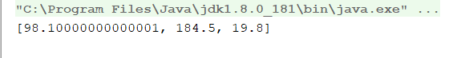
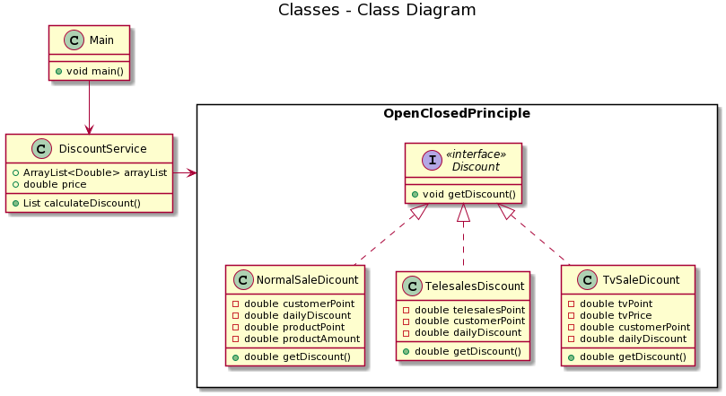

= Open-ClosedPrinciple

Bir sınıf ya da fonksiyon var olan özellikleri korumalı yani davranışını değiştirmiyor olmalı ve yeni özellikler kazanabilmelidir.
Sınıflarımız/fonksiyonlarımız değişikliğe kapalı ancak yeni davranışların eklenmesine açık olmalıdır.

* Bu prensip; sürdürülebilir ve tekrar kullanılabilir yapıda kod yazmanın temelini oluşturur.
Robert C. Martin

Open Sınıf için yeni davranışlar eklenebilmesini sağlar. Gereksinimler değiştiğinde, yeni gereksinimlerin karşılanabilmesi için bir sınıfa yeni veya farklı davranışlar eklenebilir olmasıdır.
Closed Bir sınıf temel özelliklerinin değişimi ise mümkün olmamalıdır.

Ben projemde bir e-ticaret sistemi için satış kanallarına göre indirim eklenmesi ve hesaplanması konusunu ele aldım, her satış kanalı için ayrı olan indirim hesaplama modelimi bu presibe uygun olarak tasarladım ve her yeni kanal eklendiğinde modelin değişmesine gerek kalmayacak yeni özellikler kazanabilcektir.

== Open-ClosedPrinciple Kodu

[source,Java]
----
public interface Discount {<1>
    double getDiscount();
}
public class DiscountService {<2>

    ArrayList<Double> arrayList = new ArrayList<Double>();
    double price;
    public List calculateDiscount(List<Discount> discounts) {
        for (Discount discount: discounts){
            price = discount.getDiscount();
            arrayList.add(price);
        }
        return arrayList;
    }
}
public class NormalSaleDicount implements Discount{<3>

    private double customerPoint;
    private double dailyDiscount;
    private double productPoint;
    private double productAmount;

    public double getDiscount() {
        return ((customerPoint*productPoint)+(dailyDiscount)-(productAmount/5.0))*0.9;
    }

    public double getCustomerPoint() {
        return customerPoint;
    }

    public void setCustomerPoint(double customerPoint) {
        this.customerPoint = customerPoint;
    }

    public double getDailyDiscount() {
        return dailyDiscount;
    }

    public void setDailyDiscount(double dailyDiscount) {
        this.dailyDiscount = dailyDiscount;
    }

    public double getProductPoint() {
        return productPoint;
    }

    public void setProductPoint(double productPoint) {
        this.productPoint = productPoint;
    }

    public double getProductAmount() {
        return productAmount;
    }

    public void setProductAmount(double productAmount) {
        this.productAmount = productAmount;
    }
}
public class TelesalesDiscount implements Discount{

    private double telesalesPoint;
    private double customerPoint;
    private double dailyDiscount;

    public double getTelesalesPoint() {
        return telesalesPoint;
    }

    public void setTelesalesPoint(double telesalesPoint) {
        this.telesalesPoint = telesalesPoint;
    }

    public double getCustomerPoint() {
        return customerPoint;
    }

    public void setCustomerPoint(double customerPoint) {
        this.customerPoint = customerPoint;
    }

    public double getDailyDiscount() {
        return dailyDiscount;
    }

    public void setDailyDiscount(double dailyDiscount) {
        this.dailyDiscount = dailyDiscount;
    }

    public double getDiscount() {
        return (telesalesPoint*customerPoint+(dailyDiscount))*(0.9);
    }
}
public class TvSaleDicount implements Discount {

    private double tvPoint;
    private double tvPrice;
    private double customerPoint;
    private double dailyDiscount;

    public double getTvPoint() {
        return tvPoint;
    }

    public void setTvPoint(double tvPoint) {
        this.tvPoint = tvPoint;
    }

    public double getTvPrice() {
        return tvPrice;
    }

    public void setTvPrice(double tvPrice) {
        this.tvPrice = tvPrice;
    }

    public double getCustomerPoint() {
        return customerPoint;
    }

    public void setCustomerPoint(double customerPoint) {
        this.customerPoint = customerPoint;
    }

    public double getDailyDiscount() {
        return dailyDiscount;
    }

    public void setDailyDiscount(double dailyDiscount) {
        this.dailyDiscount = dailyDiscount;
    }

    public double getDiscount() {
        return (customerPoint*tvPoint+(dailyDiscount)-(tvPrice*(0.1)))*(0.9);
    }
}
public class Main {

    public static void main(String[] args){
        NormalSaleDicount normalSaleDicount = new NormalSaleDicount();
        normalSaleDicount.setCustomerPoint(Double.valueOf(5));
        normalSaleDicount.setDailyDiscount(Double.valueOf(4));
        normalSaleDicount.setProductAmount(Double.valueOf(100));
        normalSaleDicount.setProductPoint(Double.valueOf(25));

        TelesalesDiscount telesalesDiscount = new TelesalesDiscount();
        telesalesDiscount.setCustomerPoint(Double.valueOf(10));
        telesalesDiscount.setDailyDiscount(Double.valueOf(5));
        telesalesDiscount.setTelesalesPoint(Double.valueOf(20));

        TvSaleDicount tvSaleDicount = new TvSaleDicount();
        tvSaleDicount.setCustomerPoint(Double.valueOf(15));
        tvSaleDicount.setDailyDiscount(Double.valueOf(10));
        tvSaleDicount.setTvPoint(Double.valueOf(1));
        tvSaleDicount.setTvPrice(Double.valueOf(30));

        ArrayList<Discount> arrayList = new ArrayList<Discount>();
        arrayList.add(normalSaleDicount);
        arrayList.add(telesalesDiscount);
        arrayList.add(tvSaleDicount);

        DiscountService discountService = new DiscountService();
        System.out.println(discountService.calculateDiscount(arrayList));
    }
}
----

<1> Burada  getDiscount metodumuzu bulunduran interfacemizi oluşturuyoruz.
<2> Burada prensibimize uygun hesaplama yaptığımız servisimizi yazıyoruz
<3> Burada diğer satış kanallarımızda yaptığımız gibi farklı indirim hesaplama işlemini yazıyoruz.

=== Kod Çıktısı

Kod çıktısı olarak open-closed prensibimize uygun olarak hesaplanmış indirim değerlerini görüyoruz.

== UML Diyagramı
....
@startuml
title Classes - Class Diagram
rectangle OpenClosedPrinciple{
interface Discount<<interface>> {
  +void getDiscount()
}
class NormalSaleDicount{
  -double customerPoint
  -double dailyDiscount
  -double productPoint
  -double productAmount
  +double getDiscount()
}
class TelesalesDiscount{
  -double telesalesPoint
  -double customerPoint
  -double dailyDiscount
  +double getDiscount()
}
class TvSaleDicount{
  -double tvPoint
  -double tvPrice
  -double customerPoint
  -double dailyDiscount
  +double getDiscount()
}
}
class DiscountService {
  +ArrayList<Double> arrayList
  +double price
  +List calculateDiscount()
}
class Main{
  +void main()
}
Discount<|.. NormalSaleDicount
Discount<|.. TelesalesDiscount
Discount<|.. TvSaleDicount
Main--> DiscountService
DiscountService -right->OpenClosedPrinciple
@enduml
....
